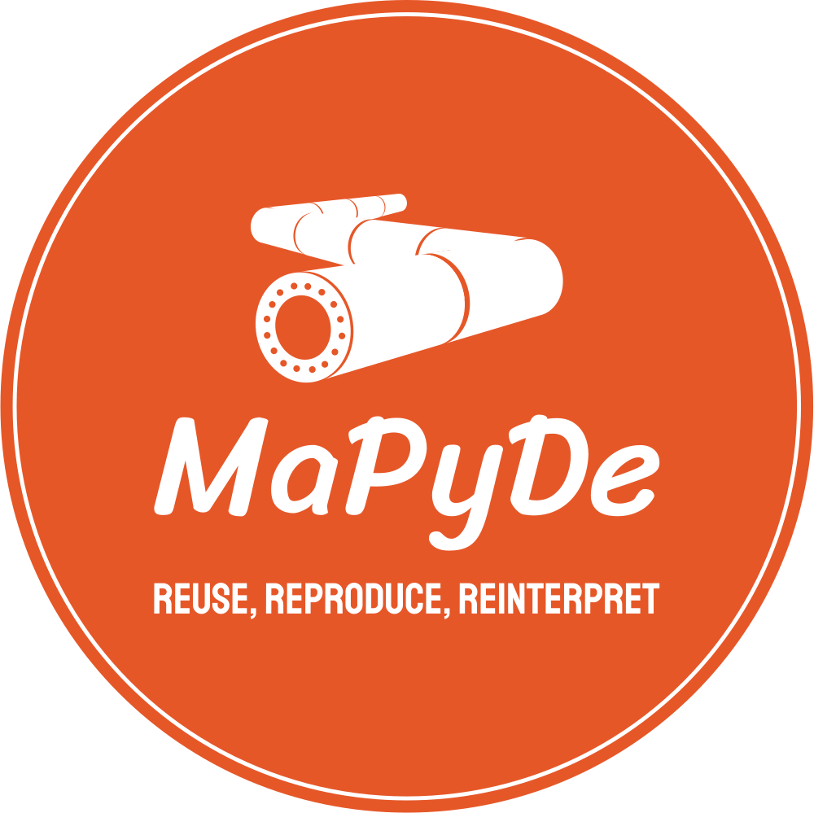

# mapyde

{ align="left" width="300" role="img" }

--8<-- "README.md:badges"

---

MaPyDe stands for MadGraph-Pythia-Delphes which is a utility that allows one to
run all of the various HEP toolings or chain them together and perform a quick
analysis with the results, such as running CERN ATLAS SimpleAnalysis or pyhf.

## Features

<!-- prettier-ignore-start -->

- Multiple backends supported
    - [x] docker
    - [x] singularity
    - [x] apptainer
- Easy configuration with sensible defaults
- Usable [CLI](cli/about.md) relying on a single config file

<!-- prettier-ignore-end -->

## License

mapyde is distributed under the terms of the [Apache 2.0][license-link] license.

## Navigation

Documentation for specific `MAJOR.MINOR` versions can be chosen by using the
dropdown on the top of every page. The `dev` version reflects changes that have
not yet been released.

Also, desktop readers can use special keyboard shortcuts:

| Keys                                                         | Action                          |
| ------------------------------------------------------------ | ------------------------------- |
| <ul><li><kbd>,</kbd> (comma)</li><li><kbd>p</kbd></li></ul>  | Navigate to the "previous" page |
| <ul><li><kbd>.</kbd> (period)</li><li><kbd>n</kbd></li></ul> | Navigate to the "next" page     |
| <ul><li><kbd>/</kbd></li><li><kbd>s</kbd></li></ul>          | Display the search modal        |
